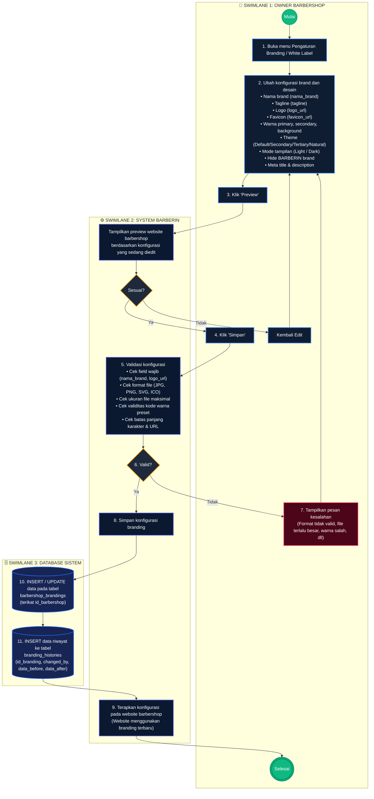
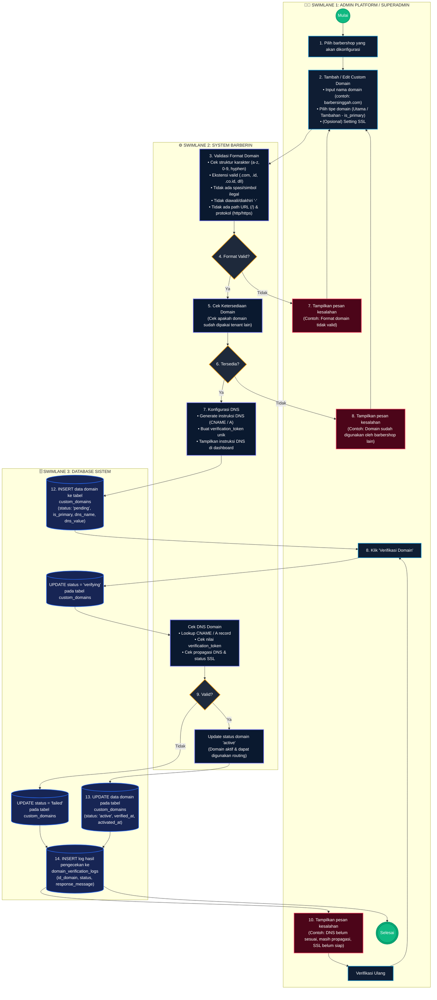
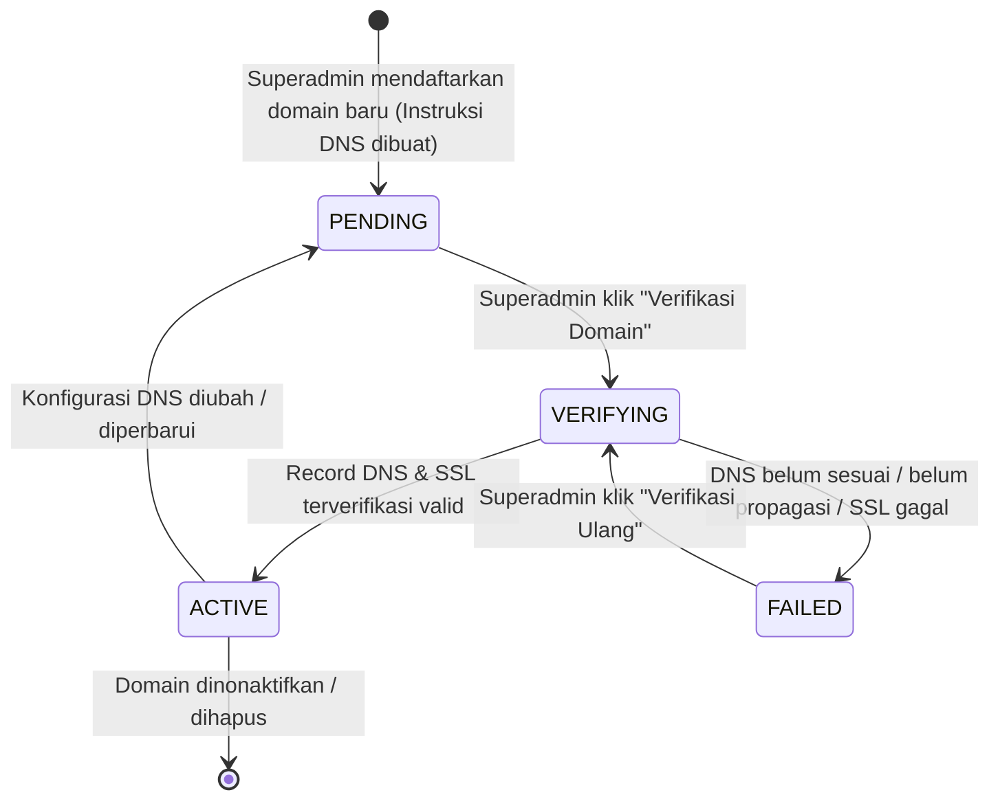
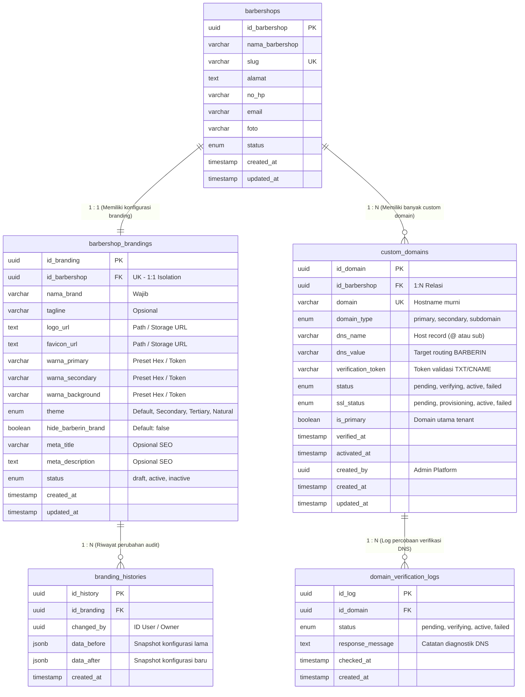

# BPMN — WHITE LABELING, CUSTOM DESIGN & CUSTOM DOMAIN
## Sistem Manajemen Barbershop Modern — BARBERIN
**Versi: 1.1**  
**Tanggal Pembaruan: 29 September 2026**  
**Dokumen Referensi: BPMN Versi 1.1 & ERD Versi 1.0 (White Labeling & Custom Domain)**

---

## DAFTAR ISI
1. [Ringkasan Eksekutif & Prinsip Desain](#1-ringkasan-eksekutif--prinsip-desain)
2. [Pemisahan Hak Akses & Matriks Otorisasi](#2-pemisahan-hak-akses--matriks-otorisasi)
3. [BPMN 01 — White Labeling & Custom Design (Owner Barbershop)](#3-bpmn-01--white-labeling--custom-design-owner-barbershop)
   - 3.1. [Diagram Alur BPMN 01 (Mermaid Swimlanes)](#31-diagram-alur-bpmn-01-mermaid-swimlanes)
   - 3.2. [Spesifikasi Node & Rincian Proses 01](#32-spesifikasi-node--rincian-proses-01)
   - 3.3. [Aturan Validasi Konfigurasi Branding](#33-aturan-validasi-konfigurasi-branding)
   - 3.4. [Pencatatan Audit Trail (branding_histories)](#34-pencatatan-audit-trail-branding_histories)
4. [BPMN 02 — Custom Domain (Admin Platform / Superadmin)](#4-bpmn-02--custom-domain-admin-platform--superadmin)
   - 4.1. [Diagram Alur BPMN 02 (Mermaid Swimlanes)](#41-diagram-alur-bpmn-02-mermaid-swimlanes)
   - 4.2. [Spesifikasi Node & Rincian Proses 02](#42-spesifikasi-node--rincian-proses-02)
   - 4.3. [Aturan Format & Ketersediaan Domain](#43-aturan-format--ketersediaan-domain)
   - 4.4. [State Machine & Verifikasi DNS](#44-state-machine--verifikasi-dns)
5. [Sinkronisasi ERD & Struktur Database](#5-sinkronisasi-erd--struktur-database)
6. [Tabel Perbandingan Versi (Changelog Versi 1.0 ke 1.1)](#6-tabel-perbandingan-versi-changelog-versi-10-ke-11)

---

## 1. RINGKASAN EKSEKUTIF & PRINSIP DESAIN

Dokumen ini mendefinisikan pembaruan arsitektural proses bisnis (**Business Process Model and Notation — BPMN Versi 1.1**) pada platform **BARBERIN** untuk dua kapabilitas utama:
1. **White Labeling / Custom Design**: Memungkinkan Pemilik (*Owner*) mengatur identitas visual website barbershop miliknya secara mandiri dan aman tanpa merusak struktur utama platform BARBERIN.
2. **Custom Domain**: Memungkinkan Admin Platform (*Superadmin*) menghubungkan, mengonfigurasi DNS, memverifikasi, dan mengaktifkan nama domain kustom untuk satu atau banyak barbershop (*multi-tenant*).

### Prinsip Utama:
- **Tenant Isolation**: Setiap konfigurasi branding terisolasi secara mutlak berdasarkan `id_barbershop`. Owner hanya dapat melihat dan memodifikasi data barbershop miliknya sendiri.
- **Strict Role Boundaries**: Konfigurasi domain dan DNS adalah ranah infrastruktur platform yang secara eksklusif dikelola oleh **Superadmin / Admin Platform**. Owner tidak memiliki hak akses menambah, mengedit, atau memverifikasi custom domain.
- **Single Source of Truth**: Tabel `barbershop_brandings` menjadi satu-satunya entitas penyimpan konfigurasi branding aktif (tidak ada duplikasi tabel).
- **Traceability & Auditability**: Setiap modifikasi branding dicatat pada `branding_histories` (menyimpan data sebelum dan sesudah perubahan), dan setiap percobaan verifikasi DNS dicatat pada `domain_verification_logs`.
- **Zero UI Regression**: Kompatibel penuh dengan desain wireframe antarmuka Owner Settings / Tema dan skema ERD yang sudah dirancang.

---

## 2. PEMISAHAN HAK AKSES & MATRIKS OTORISASI

| Fitur / Aksi | Owner Barbershop | Admin Platform / Superadmin | Catatan Keamanan |
| :--- | :---: | :---: | :--- |
| **Buka Menu Pengaturan Branding / White Label** | ✅ Ya | ❌ Tidak (Opsional via Impersonate) | Akses via sidebar Owner (`/owner/settings` atau `/owner/theme`) |
| **Ubah Nama Brand, Tagline, Logo, Favicon** | ✅ Ya | ❌ Tidak langsung | Hanya untuk barbershop yang dikelola Owner (`id_barbershop`) |
| **Ubah Tema, Mode Tampilan, & Preset Warna** | ✅ Ya | ❌ Tidak langsung | Menggunakan kombinasi preset kontras tinggi yang aman dibaca |
| **Preview Perubahan Branding** | ✅ Ya | ❌ Tidak | Simulasi visual sebelum disimpan ke database |
| **Simpan Konfigurasi Branding** | ✅ Ya | ❌ Tidak langsung | Memicu validasi sistem & pencatatan `branding_histories` |
| **Pilih Barbershop untuk Custom Domain** | ❌ **Dilarang** | ✅ Ya | Superadmin memilih tenant aktif dari daftar barbershop |
| **Tambah / Edit Custom Domain** | ❌ **Dilarang** | ✅ Ya | Memasukkan domain, tipe (utama/tambahan), SSL setting |
| **Validasi Format & Ketersediaan Domain** | ❌ **Dilarang** | ✅ Otomatis oleh Sistem | Pengecekan keunikan global seluruh database |
| **Generate & Tampilkan Instruksi DNS** | ❌ **Dilarang** | ✅ Ya | Sistem membuat record CNAME / A & verification token |
| **Jalankan Verifikasi DNS Domain** | ❌ **Dilarang** | ✅ Ya | Melakukan DNS lookup real-time & pencatatan log |
| **Aktivasi / Nonaktifkan Custom Domain** | ❌ **Dilarang** | ✅ Ya | Mengubah status domain menjadi `active` / `failed` |

---

## 3. BPMN 01 — WHITE LABELING & CUSTOM DESIGN (OWNER BARBERSHOP)

> **Tujuan Proses**:  
> Memberikan kendali penuh kepada Owner untuk mempersonalisasi nama brand, logo, favicon, warna, tema, dan metadata SEO barbershop miliknya, dengan perlindungan validasi ketat, fitur pratinjau (*preview*), serta pencatatan riwayat perubahan (*history*).

### 3.1. Diagram Alur BPMN 01 (Mermaid Swimlanes)

---

### 3.2. Spesifikasi Node & Rincian Proses 01

#### Node 1: Buka Menu Pengaturan Branding / White Label (Aktor: Owner)
- **Deskripsi**: Owner mengakses dashboard manajemen dan memilih menu **Pengaturan Branding / White Label** (atau tab *Tema* pada bilah navigasi).
- **Kondisi**: Owner telah terautentikasi dan sesi terikat pada tenant aktif (`id_barbershop`).
- **Data Awal**: Sistem mengambil data branding aktif dari tabel `barbershop_brandings`. Jika belum pernah dikonfigurasi, sistem memuat nilai *default* BARBERIN.

#### Node 2: Ubah Konfigurasi Brand dan Desain (Aktor: Owner)
Owner mengisi/mengubah field identitas visual yang disediakan:
1. **Nama Brand (`nama_brand`)**: Nama komersial barbershop (contoh: *"Singgah Barbershop"*). Wajib diisi.
2. **Tagline (`tagline`)**: Slogan ringkas barbershop (contoh: *"Potong rapi, tampil percaya diri"*).
3. **Logo (`logo_url`)**: File gambar logo utama barbershop (JPG, PNG, atau SVG).
4. **Favicon (`favicon_url`)**: Ikon tab browser (ICO atau PNG, rekomendasi 32×32 piksel).
5. **Warna Utama / Primary (`warna_primary`)**: Warna aksen utama tombol dan fokus (pilihan preset: Blue, Emerald, Purple, Rose, Amber, Slate).
6. **Warna Sekunder (`warna_secondary`)**: Warna elemen pendukung dan badge.
7. **Warna Background (`warna_background`)**: Warna dasar kontainer/kartu.
8. **Theme Preset (`theme`)**: Pilihan gaya layout antarmuka (*Default*, *Secondary*, *Tertiary*, *Natural*).
9. **Mode Tampilan**: Pemilihan tema dasar visual: *Light* atau *Dark*.
10. **Hide BARBERIN Brand (`hide_barberin_brand`)**: Sakelar Boolean untuk menyembunyikan emblem *"Powered by BARBERIN"*.
11. **Meta Title & Description (`meta_title`, `meta_description`)**: Pengaturan cuplikan SEO saat tautan barbershop dibagikan ke media sosial / Google Search.

#### Node 3: Klik "Preview" & Tampilkan Pratinjau (Aktor: Owner & System)
- **Tindakan**: Owner mengklik tombol **"Preview"**.
- **Respon Sistem**: Menampilkan jendela/modal pratinjau interaktif website barbershop secara *real-time* menggunakan variabel warna, logo, dan layout yang sedang diedit tanpa mengubah data live.
- **Gateway Decision "Sesuai?"**:
  - **TIDAK**: Owner mengklik **"Kembali Edit"**, alur kembali ke Node 2 untuk memperbaiki konfigurasi. Looping ini dapat dilakukan berulang kali secara leluasa.
  - **YA**: Owner merasa puas dan melanjutkan ke Node 4 (Klik Simpan).

#### Node 4 & 5: Klik Simpan & Validasi Konfigurasi (Aktor: Owner & System)
- **Tindakan**: Owner menekan tombol **"Simpan Perubahan"**.
- **Respon Sistem**: Server function memvalidasi payload input:
  - *Kelengkapan*: Field `nama_brand` tidak boleh kosong.
  - *Format Gambar*: File logo dan favicon harus berekstensi `.jpg`, `.jpeg`, `.png`, `.svg`, atau `.ico`.
  - *Ukuran Gambar*: Maksimal 5 MB per berkas.
  - *Kode Warna*: Mengikuti preset palet warna BARBERIN (mencegah tabrakan warna teks/elemen).
  - *Panjang Karakter*: `nama_brand` maks 100 karakter, `tagline` maks 150 karakter, `meta_title` maks 150 karakter.
  - *URL*: Jika menggunakan URL eksternal, harus berupa protokol HTTPS yang sah.

#### Gateway Decision 6: Valid?
- **TIDAK**: Sistem beralih ke **Node 7 (Tampilkan Pesan Kesalahan)**. Notifikasi *toast error* ditampilkan (misal: *"Format file favicon harus berupa ICO/PNG"* atau *"Nama brand tidak boleh kosong"*), lalu alur dikembalikan ke Node 2 tanpa menghapus input yang sudah diisi.
- **YA**: Sistem melanjutkan ke **Node 8 (Simpan Konfigurasi Branding)**.

#### Node 10 & 11: Operasi Database (Aktor: Database Sistem)
1. **Pembaruan Konfigurasi (`barbershop_brandings`)**:
   - Jika record sudah ada: Jalankan `UPDATE barbershop_brandings SET ... WHERE id_barbershop = :tenantId`.
   - Jika belum ada (tenant baru): Jalankan `INSERT INTO barbershop_brandings (...) VALUES (...)`.
2. **Pencatatan Audit Trail (`branding_histories`)**:
   - Sistem mengambil snapshot data sebelum perubahan (`data_before`) dan data sesudah perubahan (`data_after`).
   - Jalankan `INSERT INTO branding_histories (id_branding, changed_by, data_before, data_after, created_at)`.
   - Menjamin akuntabilitas bila terjadi kesalahan konfigurasi oleh staf Owner.

#### Node 9: Terapkan Konfigurasi pada Website Barbershop (Aktor: System)
- Konfigurasi baru langsung aktif untuk halaman publik pelanggan (`/$barbershopSlug/customer/*`).
- Cache CDN / SSR dibersihkan (*revalidated*).
- Sistem menampilkan notifikasi sukses: *"Konfigurasi branding berhasil diperbarui"*.
- Alur selesai (**Selesai**).

---

## 4. BPMN 02 — CUSTOM DOMAIN (ADMIN PLATFORM / SUPERADMIN)

> **Tujuan Proses**:  
> Memberikan alur kerja bagi Superadmin untuk mendaftarkan nama domain khusus milik barbershop, memvalidasi sintaks dan keunikan domain, menghasilkan parameter instruksi DNS, melakukan verifikasi DNS otomatis, dan mengaktifkan perutean SSL/Domain secara aman.

### 4.1. Diagram Alur BPMN 02 (Mermaid Swimlanes)

---

### 4.2. Spesifikasi Node & Rincian Proses 02

#### Node 1: Pilih Barbershop (Aktor: Admin Platform / Superadmin)
- Superadmin membuka portal Superadmin (`/superadmin/tenants`).
- Memilih salah satu barbershop yang mengajukan atau membutuhkan pengaturan domain kustom.

#### Node 2: Tambah / Edit Custom Domain (Aktor: Superadmin)
Superadmin memasukkan data:
- **Domain**: Nama domain yang didaftarkan (misal: `barberinsinggah.com` atau `app.barberin123.com`).
- **Domain Type**: Menentukan apakah domain bertindak sebagai domain utama (*Primary*) atau domain alias/tambahan (*Secondary*). Kolom `is_primary` di database.
- **SSL Setting**: Pilihan otomatisasi sertifikat SSL/TLS via platform.

#### Node 3 & Gateway 4: Validasi Format Domain (Aktor: System)
Sistem melakukan validasi sintaks nama domain:
- **Aturan Positif**:
  - Karakter yang diperbolehkan: huruf kecil `a-z`, angka `0-9`, dan tanda hubung `-`.
  - Menggunakan titik `.` sebagai pemisah tingkatan (*dot separator*).
  - Memiliki Top-Level Domain (TLD) yang sah (`.com`, `.id`, `.co.id`, `.net`, `.org`, dll).
- **Aturan Larangan (Strict Reject)**:
  - ❌ Tidak boleh mengandung spasi atau karakter khusus (`@`, `#`, `$`, `_`, dll).
  - ❌ Tidak boleh diawali atau diakhiri tanda hubung (`-barberin.com` atau `barberin-.com`).
  - ❌ Tidak boleh memiliki titik ganda (`barberin..com`).
  - ❌ Tidak boleh menyertakan path URL (`barberin.com/login`).
  - ❌ Tidak boleh menyertakan protokol (`https://barberin.com` atau `http://`).
  - ❌ Domain harus nama host murni.
- **Hasil Gateway 4**:
  - Jika **Tidak Valid**: Tampilkan error *"Format domain tidak valid"*, alur kembali ke Node 2.
  - Jika **Valid**: Lanjut ke Node 5.

#### Node 5 & Gateway 6: Cek Ketersediaan Domain (Aktor: System)
- Sistem melakukan kueri ke tabel `custom_domains` untuk memastikan domain tersebut belum didaftarkan oleh tenant/barbershop lain (`SELECT COUNT(*) FROM custom_domains WHERE domain = :domain`).
- **Hasil Gateway 6**:
  - Jika **Tidak Tersedia (Sudah Dipakai)**: Tampilkan error *"Domain sudah digunakan oleh barbershop lain"*, alur kembali ke Node 2.
  - Jika **Tersedia**: Lanjut ke Node 7.

#### Node 7 & Database 12: Konfigurasi DNS & Simpan Status "Pending"
- **Respon Sistem**:
  - Menghasilkan token verifikasi unik (`verification_token`, contoh: `barberin-verify-9f8a2bc7`).
  - Menghasilkan instruksi record DNS:
    - **Type**: `CNAME` (atau `A` Record untuk root domain).
    - **Host / Name**: `@` atau subdomain (misal: `cukur`).
    - **Value / Target**: Host routing platform BARBERIN (misal: `cname.barberin.id` atau IP gateway).
- **Operasi Database 12**:
  - Menyimpan data domain baru ke tabel `custom_domains` dengan status awal: **`pending`**.
  - Menyimpan nilai `dns_name`, `dns_value`, `verification_token`, dan `is_primary`.
- **Instruksi**: Admin/Klien mengonfigurasi record DNS tersebut di registrar domain mereka (misal: Niagahoster, Cloudflare, Namecheap).

#### Node 8, DB Update "Verifying" & Cek DNS Domain (Aktor: Admin & System)
- Setelah DNS diatur di registrar, Superadmin menekan tombol **"Verifikasi Domain"**.
- Database memperbarui status domain menjadi: **`verifying`**.
- Sistem menjalankan worker/service pengecekan DNS:
  - Melakukan query DNS resolver terhadap host name yang didaftarkan.
  - Memeriksa apakah nilai `CNAME` atau record `TXT verification_token` cocok dengan yang diharapkan.
  - Memeriksa kesiapan sertifikat SSL.

#### Gateway Decision 9: Valid?
- **Jika TIDAK (Verifikasi Gagal / Belum Propagasi)**:
  - Database mengupdate status domain menjadi: **`failed`** (DB2_3).
  - Sistem mencatat kegagalan ke tabel `domain_verification_logs` (DB2_5) dengan alasan (misal: *"DNS belum sesuai: target mengarah ke 127.0.0.1"* atau *"DNS record belum ditemukan / masih dalam masa propagasi"*).
  - Sistem menampilkan banner pesan kesalahan (Node 10).
  - Menyediakan tombol **"Verifikasi Ulang"** agar Superadmin dapat mencoba lagi setelah propagasi selesai.
- **Jika YA (Verifikasi Berhasil)**:
  - Sistem mengupdate status domain menjadi: **`active`** (S2_5).
  - Database menyimpan timestamp verifikasi dan aktivasi: `verified_at = NOW()`, `activated_at = NOW()`, status = `active` (Node 13).
  - Sistem mencatat keberhasilan ke tabel `domain_verification_logs` (Node 14).
  - Domain kustom sekarang aktif dan melayani lalu lintas pengguna untuk barbershop tersebut.
  - Alur selesai (**Selesai**).

---

## 4.3. ATURAN FORMAT & KETERSEDIAAN DOMAIN

| Kategori Format | Contoh Format Valid | Status |
| :--- | :--- | :---: |
| **Domain Utama** | `barberinsinggah.com` | ✅ Valid |
| **Subdomain Standar** | `cukur.barberinsinggah.com` | ✅ Valid |
| **Custom Domain Bisnis** | `barberin-singgah.id` | ✅ Valid |
| **Subdomain Custom** | `app.barberinsinggah.co.id` | ✅ Valid |
| **Domain dengan Hyphen** | `barberin-singgah.com` | ✅ Valid |
| **Domain dengan Angka** | `barberin123.com` | ✅ Valid |

| Format Tidak Valid | Alasan Penolakan |
| :--- | :--- |
| `barberin` | Tidak memiliki Top Level Domain (TLD) |
| `barberin.` | Diakhiri titik tanpa TLD yang jelas |
| `.com` | Hanya ekstensi tanpa nama domain |
| `barber in.com` | Mengandung spasi ilegal |
| `barber@in.com` | Mengandung karakter simbol ilegal `@` |
| `-barberin.com` | Diawali tanda hubung `-` |
| `barberin-.com` | Diakhiri tanda hubung `-` |
| `barberin..com` | Mengandung titik ganda berturut-turut |
| `barberin.com/login` | Mengandung path URL (`/login`) |
| `https://barberin.com` | Menyertakan protokol `https://` (bukan hostname murni) |
| `www.barberin.com` | Prefix `www` hanya diizinkan jika dikonfigurasikan sebagai subdomain terpisah |

---

## 4.4. STATE MACHINE & VERIFIKASI DNS

### Definisi Enum Status (`custom_domains.status`):
- **`pending`**: Domain telah disimpan di sistem BARBERIN, parameter CNAME/A telah dibuat, namun record DNS di registrar pengguna belum diperiksa.
- **`verifying`**: Sistem sedang menjalankan proses *lookup* dan validasi record DNS ke DNS server global.
- **`active`**: Record DNS telah terbukti mengarah ke infrastruktur BARBERIN dengan benar, SSL aktif, dan domain siap digunakan oleh publik.
- **`failed`**: Record DNS tidak ditemukan, salah alamat target, atau sertifikat SSL gagal diterbitkan. Dapat dilakukan verifikasi ulang kapan saja.

---

## 5. SINKRONISASI ERD & STRUKTUR DATABASE

Semua entitas dalam BPMN Versi 1.1 memiliki pemetaan 1-ke-1 yang presisi terhadap ERD platform:

---

## 6. TABEL PERBANDINGAN VERSI (CHANGELOG VERSI 1.0 KE 1.1)

| Bagian | Versi 1.0 (Lama) | Versi 1.1 (Pembaruan) | Alasan Perubahan |
| :--- | :--- | :--- | :--- |
| **Label Versi** | Versi 1.0 | **Versi 1.1 — BPMN White Labeling, Custom Design & Custom Domain** | Standar pelabelan rilis arsitektur BARBERIN |
| **Nama Menu Owner** | *"Buka menu Pengaturan Branding"* | **"Buka menu Pengaturan Branding / White Label"** (atau menu Tema di Pengaturan) | Menyelaraskan dengan wireframe antarmuka visual Owner Settings |
| **Field Warna Branding** | Input warna umum | **Warna primary, secondary, background terikat preset kontras tinggi** | Mencegah pemilihan warna yang bertabrakan dengan teks, ikon, atau tombol |
| **Theme & Mode Tampilan** | Tidak terdokumentasi terperinci | **Theme (Default/Secondary/Tertiary/Natural) + Mode Light/Dark** | Sesuai dengan wireframe kartu "Tampilan" pada modul Tema Owner |
| **Alur Preview Branding** | Hanya tombol biasa | **Looping interaktif: Preview -> Decision "Sesuai?" -> Kembali Edit / Simpan** | Memberikan kebebasan Owner bereksperimen visual sebelum menyimpan data live |
| **Audit Trail Branding** | Tidak ada tabel history | **Database mencatat perubahan ke tabel `branding_histories`** (data_before & data_after) | Memenuhi standar kepatuhan SaaS enterprise untuk pelacakan perubahan identitas |
| **Aturan Validasi Domain** | Cek format sederhana | **Validasi format ketat 8 kriteria** (bebas spasi, tanpa path, tanpa http/https, TLD sah) | Mencegah input URL salah yang merusak konfigurasi DNS / Nginx proxy |
| **Pengecekan Ketersediaan** | Tidak dipisah eksplisit | **Dedicated Decision Node: "Tersedia?"** (mengecek keunikan domain lintas seluruh tenant) | Menghindari *domain hijacking* atau duplikasi routing antar tenant |
| **Status Verifikasi Domain** | Hanya pending / active | **State Machine 4 Enum: `pending` -> `verifying` -> `active` / `failed`** | Menangani kondisi asinkron propagasi DNS global dan kegagalan sementara |
| **Pencatatan Log DNS** | Tidak ada log verifikasi | **Pencatatan riwayat lookup ke `domain_verification_logs`** | Memudahkan tim Superadmin men-diagnosa kesalahan record DNS klien |
| **Pemisahan Peran (RBAC)** | Belum ditegaskan | **Pemisahan tegas: Owner hanya Branding Barbershop Sendiri; Superadmin pengelola Domain** | Menjaga keamanan infrastruktur domain level platform multi-tenant |

---
*Dokumentasi ini disahkan sebagai acuan baku alur kerja BPMN dan integrasi sistem BARBERIN Versi 1.1.*
